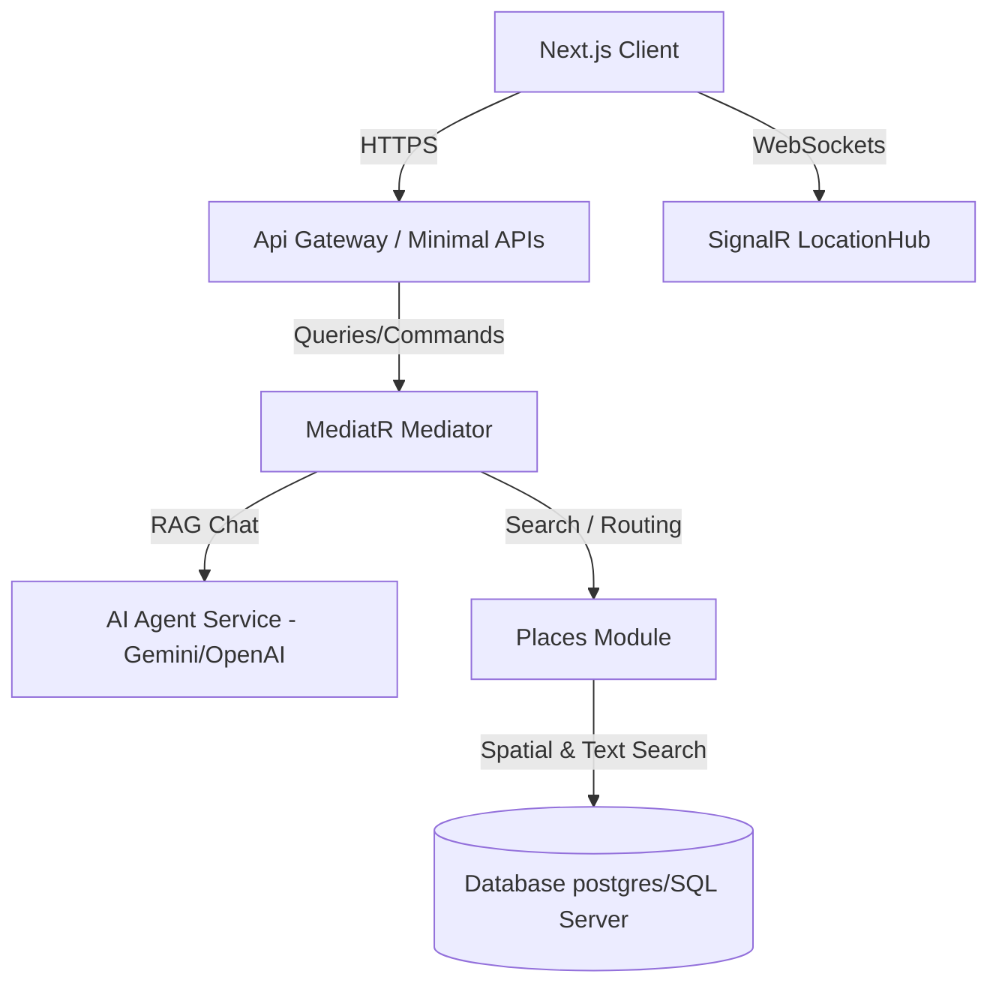

# Architecture Overview and Scope

This document describes the backend scope of MiaMap as a Waze-like system, including map search, routing, crowdsourcing, realtime features, and an AI Agent.

> [!WARNING]
> **Geographic data scope limit**: The current system supports **District 1, Ho Chi Minh City, Vietnam only**. This is an intentional limit to keep spatial data size and compute cost manageable.
>
> Approximate coordinate scope:
> - Latitude: `10.7600` to `10.7950`
> - Longitude: `106.6800` to `106.7150`
>
> Any data outside this area may be filtered out, skipped during import, or left unsupported by routing and search features.

## Extended Architecture Model

## Stage List

- [Stage 0 - Foundation and static routing](./01-stage-0-foundation.md)
- [Stage 1 - Crowdsourced incidents](./02-stage-1-crowdsourced-incidents.md)
- [Stage 2 - Dynamic routing](./03-stage-2-dynamic-routing.md)
- [Stage 3 - Realtime location and SignalR](./04-stage-3-realtime-location.md)
- [Stage 4 - Gamification](./05-stage-4-gamification.md)
- [Stage 5 - Product search and AI Agent](./06-stage-5-search-and-ai-agent.md)
