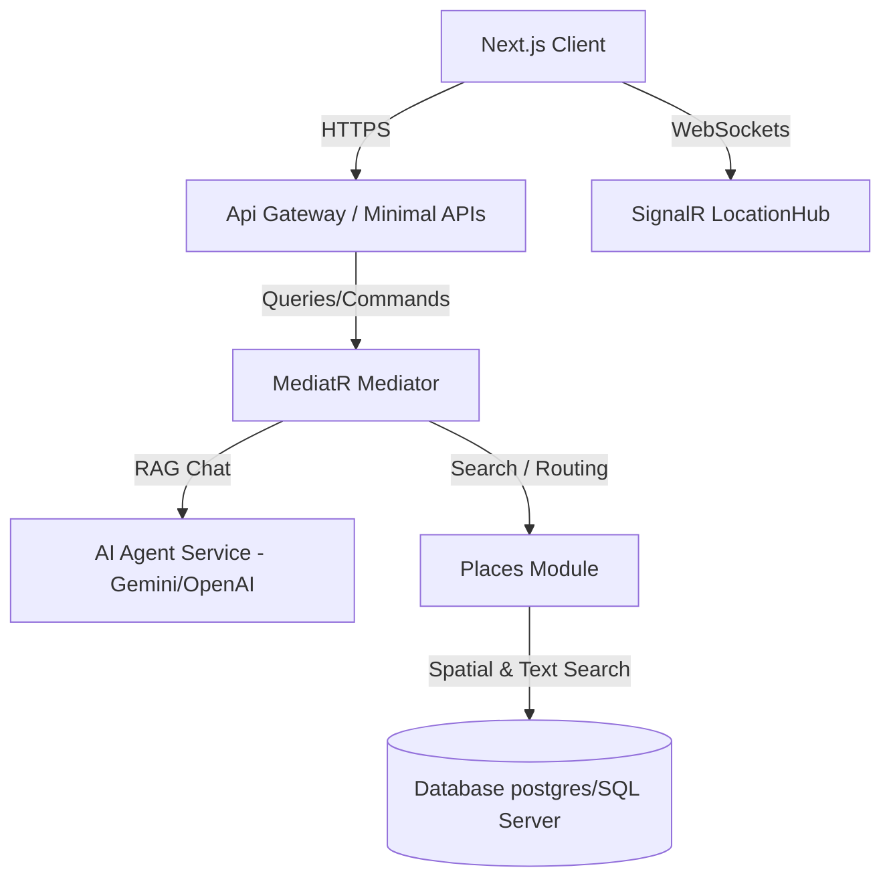

# Waze Clone - Backend Technical Roadmap

Tài liệu này đặc tả chi tiết kế hoạch phát triển backend của dự án MiaMap (.NET Clean Architecture) thành hệ thống tương đương Waze, bổ sung tìm kiếm sản phẩm chi tiết (menu search) và hỗ trợ AI Agent.

> [!WARNING]
> **GIỚI HẠN PHẠM VI DỮ LIỆU ĐỊA LÝ**: Do lượng dữ liệu không gian và đồ thị giao thông của cả nước (hoặc cả thành phố) là cực kỳ lớn và tốn tài nguyên tính toán, toàn bộ hệ thống MiaMap hiện tại và các tính năng mở rộng của Waze Clone **CHỈ ĐƯỢC GIỚI HẠN HOẠT ĐỘNG TẠI QUẬN 1, THÀNH PHỐ HỒ CHÍ MINH, VIỆT NAM** (Kinh độ/Vĩ độ tương đối: `10.7600` đến `10.7950` vĩ Bắc, `106.6800` đến `106.7150` kinh Đông). 
> Mọi dữ liệu nhập ngoài (OSM import), địa điểm tìm kiếm, hoặc tọa độ điều hướng nằm ngoài phạm vi Quận 1 sẽ bị loại bỏ hoặc không được hỗ trợ để đảm bảo hiệu năng tính toán.

---

## MÔ HÌNH KIẾN TRÚC MỞ RỘNG

---

## CHI TIẾT CÁC GIAI ĐOẠN PHÁT TRIỂN (BACKEND)

### STAGE 0: KHỞI TẠO NỀN TẢNG & ĐỊNH TUYẾN TĨNH QUẬN 1 (ĐÃ HOÀN THÀNH - COMPLETED)
*   **Mục tiêu**: Thiết lập cấu trúc cơ sở dữ liệu địa lý cơ bản và thuật toán tìm đường tĩnh cho Quận 1, TP. HCM.
*   **Chi tiết triển khai thực tế**:
    *   `[DONE]` Thiết lập DB Schema: Tạo các bảng `nodes` (các nút giao), `roads` (các đoạn đường kết nối), `places` (các địa điểm POI) và `users`.
    *   `[DONE]` Nhập dữ liệu địa lý thô (Import OpenStreetMap data): Chỉ lọc và import dữ liệu Nodes/Roads thuộc phạm vi Quận 1, TP. HCM.
    *   `[DONE]` Thuật toán Dijkstra tĩnh: Viết [RoutingRepository.cs](file:///c:/github-projects/MiaMap/miamap-backend/Infrastructure/Places/RoutingRepository.cs) sử dụng thư viện `NetTopologySuite.Geometries` để xây dựng đồ thị giao thông Quận 1 và tìm đường đi ngắn nhất dựa trên khoảng cách địa lý đơn thuần giữa điểm bắt đầu và điểm kết thúc (chưa có yếu tố kẹt xe hay thời gian).
    *   `[DONE]` API Endpoints tĩnh: Cung cấp API `GET /places/route` nhận tọa độ `(lat, lng)` đầu/cuối và trả về danh sách `GeoPoint` vẽ đường đi tĩnh.

### STAGE 1: BÁO CÁO SỰ CỐ TỪ CỘNG ĐỒNG (CROWDSOURCED INCIDENTS)
*   **Mục tiêu**: Xây dựng APIs cho phép người dùng báo cáo sự cố giao thông theo thời gian thực (kẹt xe, cảnh sát, tai nạn, nguy hiểm) trong khu vực Quận 1.
*   **Database Table `reports`**:
    *   `Id` (int, PK), `CreatedByUserId` (Guid), `ReportType` (nvarchar), `SubType` (nvarchar), `Location` (Geometry Point, SRID 4326), `Description` (nvarchar), `Upvotes` (int), `Downvotes` (int), `CreatedAtUtc` (datetime), `ExpiresAtUtc` (datetime), `IsActive` (bit).
*   **Các thành phần mã nguồn cần thêm**:
    *   `[NEW]` [Report.cs](file:///c:/github-projects/MiaMap/miamap-backend/Domain/Places/Report.cs): Thực thể Domain định nghĩa quy tắc hết hạn (ví dụ: `ExpiresAtUtc = CreatedAtUtc.AddMinutes(45)` cho kẹt xe).
    *   `[NEW]` [CreateReportCommand.cs](file:///c:/github-projects/MiaMap/miamap-backend/Application/Places/CreateReport/CreateReportCommand.cs): Nhận tọa độ gửi lên và tạo thực thể `Report` mới.
    *   `[NEW]` [GetActiveReportsQuery.cs](file:///c:/github-projects/MiaMap/miamap-backend/Application/Places/GetActiveReports/GetActiveReportsQuery.cs): Trả về danh sách sự cố trong bounding box hiển thị của bản đồ.
    *   `[NEW]` [VoteReportCommand.cs](file:///c:/github-projects/MiaMap/miamap-backend/Application/Places/VoteReport/VoteReportCommand.cs): Nhận phản hồi upvote/downvote từ tài xế đi ngang qua để tăng/giảm thời gian hết hạn hoặc ẩn sự cố.

### STAGE 2: MẬT ĐỘ GIAO THÔNG & ĐỊNH TUYẾN ĐỘNG (DYNAMIC DIJKSTRA)
*   **Mục tiêu**: Tối ưu hóa thuật toán tìm đường để tự động tránh các cung đường bị kẹt xe nặng tại Quận 1.
*   **Mã nguồn sửa đổi**:
    *   `[MODIFY]` [Road.cs](file:///c:/github-projects/MiaMap/miamap-backend/Domain/Places/Road.cs): Thêm trường `TrafficFactor` (hệ số cản giao thông, mặc định `1.0`) và `CurrentSpeed`.
    *   `[MODIFY]` [RoutingRepository.cs](file:///c:/github-projects/MiaMap/miamap-backend/Infrastructure/Places/RoutingRepository.cs):
        *   Trong quá trình truy vấn `roadsInBox`, quét các `reports` loại `jam` đang hoạt động trên cung đường đó.
        *   Cập nhật trọng số của cung đường bằng công thức: `Weight = Road.Length * TrafficFactor`. Đoạn nào có kẹt xe sẽ có `TrafficFactor` cao, làm thuật toán Dijkstra tự chọn hướng đi khác thông thoáng hơn.
    *   `[MODIFY]` [FindRouteResult.cs](file:///c:/github-projects/MiaMap/miamap-backend/Application/Places/FindRoute/FindRouteResult.cs): Trả về danh sách phân đoạn (`Segments`) kèm trạng thái kẹt xe (xanh, cam, đỏ) để client hiển thị màu sắc trực quan.

### STAGE 3: ĐỊNH VỊ REAL-TIME & ĐỒNG BỘ WEBSOCKETS (SIGNALR HUB)
*   **Mục tiêu**: Quản lý sự diện diện và vị trí thời gian thực của người dùng lái xe tại Quận 1.
*   **Mã nguồn thêm mới**:
    *   `[NEW]` [LocationHub.cs](file:///c:/github-projects/MiaMap/miamap-backend/Infrastructure/Realtime/LocationHub.cs):
        *   Nhận GPS định kỳ từ client gửi lên (3-5 giây/lần).
        *   Lưu tọa độ vào InMemory Cache hoặc Redis Cache gắn kèm ID và Avatar (Mood) của người dùng.
        *   Tính toán khoảng cách và phát (Broadcast) vị trí ẩn danh của người dùng khác đang hoạt động trong bán kính 1km về lại cho client.

### STAGE 4: GAME HÓA ĐÓNG GÓP (GAMIFICATION)
*   **Mục tiêu**: Tăng tương tác người dùng bằng điểm đóng góp giao thông.
*   **Mã nguồn sửa đổi**:
    *   `[MODIFY]` [User.cs](file:///c:/github-projects/MiaMap/miamap-backend/Domain/Users/User.cs): Thêm trường `Points`, `Level` và `ActiveMoodId` (icon đại diện xe trên bản đồ).
    *   Cộng điểm tự động khi gửi báo cáo sự cố được xác nhận, mở khóa các Moods đặc biệt theo Level.

### STAGE 5: TÌM KIẾM SẢN PHẨM CHI TIẾT & HỖ TRỢ AI AGENT (SEMANIC & AI AGENT)

#### A. Tìm kiếm sản phẩm chi tiết (Ví dụ: "Matcha Latte")
Để tìm kiếm được các chi tiết cụ thể bên trong thực đơn hoặc danh mục dịch vụ của cửa hàng tại Quận 1:
*   **Database Schema**:
    *   `[NEW]` Bảng `menu_items` (hoặc `products`): `Id` (int, PK), `PlaceId` (int, FK), `Name` (nvarchar), `Description` (nvarchar), `Price` (decimal), `Tags` (nvarchar).
*   **Mã nguồn thêm mới**:
    *   `[NEW]` [MenuItem.cs](file:///c:/github-projects/MiaMap/miamap-backend/Domain/Places/MenuItem.cs): Thực thể lưu trữ sản phẩm/dịch vụ của địa điểm.
    *   `[MODIFY]` [PlaceRepository.cs](file:///c:/github-projects/MiaMap/miamap-backend/Infrastructure/Places/PlaceRepository.cs):
        *   Viết hàm `SearchByProductAsync(string query, int limit)`: Sử dụng Full-Text Search hoặc tích hợp **Vector Search (PGVector / Semantic Kernel)** để tìm kiếm ngữ nghĩa trên bảng `menu_items`.
        *   *Ví dụ*: Người dùng gõ "matcha latte", hệ thống sẽ quét trong bảng `menu_items` các dòng có tên/mô tả trùng khớp, trả về danh sách `Place` sở hữu món uống này tại Quận 1.

#### B. Tích hợp AI Agent Assistant trên Bản đồ
AI Agent đóng vai trò là một trợ lý thông minh hỗ trợ tìm kiếm bằng ngôn ngữ tự nhiên và điều khiển bản đồ.
*   **Mã nguồn thêm mới**:
    *   `[NEW]` [AgentEndpoints.cs](file:///c:/github-projects/MiaMap/miamap-backend/Api/Endpoint/Agent/AgentEndpoints.cs): Cung cấp API `POST /agent/chat` (nhận câu hỏi của người dùng và tọa độ hiện tại).
    *   `[NEW]` [AgentService.cs](file:///c:/github-projects/MiaMap/miamap-backend/Application/Agent/AgentService.cs):
        *   Sử dụng OpenAI/Gemini SDK để phân tích câu lệnh của người dùng (Ví dụ: *"Tìm giúp tôi quán cà phê yên tĩnh gần đây có bán Matcha Latte và có chỗ đậu xe hơi"*).
        *   Thực hiện cơ chế RAG (Retrieval-Augmented Generation):
            1.  Quét cơ sở dữ liệu các quán cà phê có chỗ đậu xe và thực đơn chứa "Matcha Latte" trong bán kính 2km quanh tọa độ người dùng tại Quận 1.
            2.  Đưa thông tin các địa điểm tìm được làm context vào Prompt gửi cho LLM.
            3.  LLM trả về câu trả lời tự nhiên dạng text kèm danh sách các ID của địa điểm gợi ý.
        *   API trả về phản hồi dạng JSON có cấu trúc gồm:
            *   `answer` (string): Câu trả lời của trợ lý AI.
            *   `recommendedPlaces` (List<Place>): Danh sách địa điểm gợi ý kèm tọa độ để client zoom vào.
            *   `mapAction` (string): Lệnh điều khiển bản đồ gợi ý cho Frontend (Ví dụ: `zoom_to_places`, `draw_route`).
