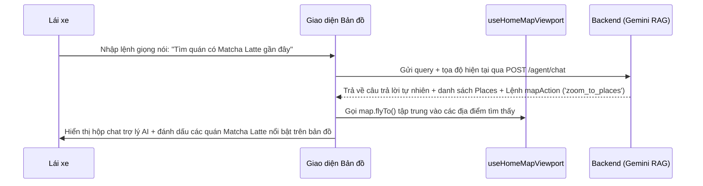

# Waze Clone - Frontend Technical Roadmap

Tài liệu này đặc tả chi tiết kế hoạch phát triển frontend của dự án MiaMap (React/Next.js & Leaflet) thành hệ thống tương đương Waze, tối ưu hiển thị trực quan và tích hợp trợ lý AI Agent.

> [!WARNING]
> **GIỚI HẠN PHẠM VI DỮ LIỆU ĐỊA LÝ**: Do lượng dữ liệu không gian và đồ thị giao thông của cả nước (hoặc cả thành phố) là cực kỳ lớn và tốn tài nguyên tính toán, toàn bộ hệ thống MiaMap hiện tại và các tính năng mở rộng của Waze Clone **CHỈ ĐƯỢC GIỚI HẠN HOẠT ĐỘNG TẠI QUẬN 1, THÀNH PHỐ HỒ CHÍ MINH, VIỆT NAM** (Kinh độ/Vĩ độ tương đối: `10.7600` đến `10.7950` vĩ Bắc, `106.6800` đến `106.7150` kinh Đông). 
> Bản đồ sẽ lấy vị trí trung tâm tại Quận 1 làm mặc định và các gợi ý tìm kiếm địa điểm, chỉ đường hoặc báo cáo sự cố chỉ giới hạn trong khu vực hành chính Quận 1.

---

## KIẾN TRÚC FRONTEND & LUỒNG TƯƠNG TÁC AI AGENT

---

## CHI TIẾT CÁC GIAI ĐOẠN PHÁT TRIỂN (FRONTEND)

### STAGE 0: KHỞI TẠO NỀN TẢNG & ĐỊNH VỊ QUẬN 1 (ĐÃ HOÀN THÀNH - COMPLETED)
*   **Mục tiêu**: Tạo giao diện bản đồ cơ bản hiển thị và định vị Quận 1, kết nối tuyến đường tĩnh.
*   **Chi tiết triển khai thực tế**:
    *   `[DONE]` Cấu hình định tâm bản đồ (Map Center): Thiết lập tọa độ mặc định tại trung tâm Quận 1, TP. HCM `[10.7712, 106.6980]`.
    *   `[DONE]` Vẽ Polyline tĩnh: Đọc danh sách điểm tọa độ từ API `GET /places/route` và vẽ đường đi bằng nét vẽ đơn sắc màu xanh dương `#1d9bf0` (Xem tại [HomeMap.tsx](file:///c:/github-projects/MiaMap/miamap-frontend/src/features/home/components/HomeMap.tsx)).
    *   `[DONE]` Thiết lập SSR: Load động component Bản đồ ở chế độ client-only (`ssr: false`) để tránh lỗi render phía server (Xem tại [home-page.tsx](file:///c:/github-projects/MiaMap/miamap-frontend/src/features/home/home-page.tsx#L11-L13)).

### STAGE 1: BÁO CÁO SỰ CỐ TỪ CỘNG ĐỒNG (HIỂN THỊ TRỰC QUAN HÓA)
*   **Mục tiêu**: Thiết kế UI trực quan nhất để gửi báo cáo chỉ với 1-2 lần chạm khi lái xe tại Quận 1.
*   **Giao diện cần phát triển**:
    *   `[NEW]` [ReportMenuModal.tsx](file:///c:/github-projects/MiaMap/miamap-frontend/src/features/home/components/ReportMenuModal.tsx): Bảng chọn sự cố nổi (Overlay) dạng tròn hoặc lưới lớn, dễ bấm bằng một ngón tay.
    *   `[MODIFY]` [HomeMap.tsx](file:///c:/github-projects/MiaMap/miamap-frontend/src/features/home/components/HomeMap.tsx):
        *   Hiển thị sự cố bằng các Custom Marker Icons bắt mắt.
        *   Tích hợp hiệu ứng nhấp nháy/phát sáng (CSS Pulse Animation) đối với các báo cáo khẩn cấp như tai nạn hoặc cảnh sát phía trước.
        *   Hộp thoại nhỏ (Popup/Tooltip) nổi lên khi đi ngang qua sự cố, có nút bình chọn nhanh "Vẫn còn" hoặc "Đã hết".

### STAGE 2: VẼ LUỒNG GIAO THÔNG ĐA SẮC MÀU (TRAFFIC POLYLINE)
*   **Mục tiêu**: Hiển thị trực quan nhất tình trạng đường đi Quận 1 (thông thoáng hay kẹt xe).
*   **Mã nguồn sửa đổi**:
    *   `[MODIFY]` [HomeMap.tsx](file:///c:/github-projects/MiaMap/miamap-frontend/src/features/home/components/HomeMap.tsx):
        *   Đọc mảng `route.segments` từ api. Vẽ các thẻ `<Polyline>` chồng lớp với hiệu ứng viền tối bên ngoài, màu sắc bên trong tượng trưng cho giao thông:
            *   **Heavy Traffic (Kẹt xe)**: Màu đỏ đậm `#ef4444` kèm hiệu ứng kẻ sọc động (running dash offset) tạo cảm giác xe di chuyển cực kỳ chậm.
            *   **Moderate Traffic (Chậm)**: Màu cam `#f97316`.
            *   **Clear Traffic (Thông thoáng)**: Màu xanh lục sáng `#10b981`.

### STAGE 3: CHẾ ĐỘ DẪN ĐƯỜNG GPS & ĐỒNG BỘ WEBSOCKETS (SIGNALR)
*   **Mục tiêu**: Trải nghiệm dẫn đường tự nhiên, hiển thị vị trí của những người dùng khác tại Quận 1.
*   **Mã nguồn phát triển**:
    *   `[NEW]` [useGeolocation.ts](file:///c:/github-projects/MiaMap/miamap-frontend/src/hooks/useGeolocation.ts): Theo dõi GPS thực tế của điện thoại, tính toán tốc độ di chuyển và góc hướng (`heading`).
    *   `[NEW]` [useNavigationSocket.ts](file:///c:/github-projects/MiaMap/miamap-frontend/src/features/home/hooks/useNavigationSocket.ts): Kết nối SignalR Hub, gửi tọa độ định kỳ và nhận tọa độ các Wazers xung quanh.
    *   `[NEW]` [NavigationOverlay.tsx](file:///c:/github-projects/MiaMap/miamap-frontend/src/features/home/components/NavigationOverlay.tsx): 
        *   Thanh điều hướng lớn ở trên đầu.
        *   Đồng hồ hiển thị tốc độ hiện tại (Speedometer) đổi màu nếu chạy quá tốc độ cho phép.
        *   Tích hợp thư viện giọng nói tự nhiên (Web Speech API) để phát âm thanh chỉ đường rẽ tiếp theo.
    *   `[MODIFY]` [HomeMap.tsx](file:///c:/github-projects/MiaMap/miamap-frontend/src/features/home/components/HomeMap.tsx): Vẽ xe của các người dùng khác (Wazers) di chuyển thực tế trên bản đồ. Tự động xoay bản đồ theo hướng di chuyển của người lái.

### STAGE 4: CÁ NHÂN HÓA HỒ SƠ & GAME HÓA
*   **Mục tiêu**: Cho phép lái xe chọn avatar xe hiển thị và tương tác.
*   **Mã nguồn phát triển**:
    *   `[NEW]` [UserProfilePanel.tsx](file:///c:/github-projects/MiaMap/miamap-frontend/src/features/home/components/UserProfilePanel.tsx): Chọn các icon Moods ngộ nghĩnh tương ứng với Level đạt được.
    *   `[NEW]` [IncidentChatBox.tsx](file:///c:/github-projects/MiaMap/miamap-frontend/src/features/home/components/IncidentChatBox.tsx): Hộp chat bình luận nhanh gắn trực tiếp vào vị trí kẹt xe/tai nạn trên bản đồ.

### STAGE 5: TRỢ LÝ AI AGENT & TÌM KIẾM CHI TIẾT SẢN PHẨM

#### A. Tìm kiếm sản phẩm chi tiết (Menu Search UI)
*   **UI/UX**:
    *   Khi gõ tìm kiếm "matcha latte" hoặc "cà phê sữa đá" tại Quận 1, danh sách kết quả (Search Panel) sẽ không chỉ hiển thị tên cửa hàng, mà hiển thị thẻ chi tiết các món nước khớp với từ khóa kèm giá cả bên dưới mỗi cửa hàng.
    *   Click vào sản phẩm sẽ hiển thị nút "Dẫn đường đến đây" ngay lập tức.

#### B. Khung trò chuyện AI Agent nổi trên Bản đồ (Floating AI Chat Panel)
Tích hợp một ô Chat Assistant góc màn hình, tạo trải nghiệm điều khiển bản đồ bằng giọng nói/văn bản:
*   **Giao diện**:
    *   `[NEW]` [AIAgentPanel.tsx](file:///c:/github-projects/MiaMap/miamap-frontend/src/features/home/components/AIAgentPanel.tsx): Panel chat nổi trên bản đồ, có nút nhập bằng giọng nói (Voice Input).
*   **Luồng xử lý (Integration)**:
    1.  Người dùng gõ: *"Tìm cho tôi quán bán Matcha Latte gần đây"*.
    2.  Frontend gửi câu hỏi và tọa độ hiện tại của bản đồ lên API Backend `POST /agent/chat`.
    3.  Nhận phản hồi từ trợ lý AI, hiển thị câu trả lời dạng bong bóng chat: *"Tôi tìm thấy 3 quán cà phê bán Matcha Latte gần bạn nhất tại Quận 1. Quán X cách 500m được đánh giá 4.8 sao..."*.
    4.  **Điều khiển Bản đồ tự động (Map Automation)**:
        *   Nếu API trả về `mapAction: "zoom_to_places"`, frontend tự động gọi hàm `map.flyTo()` hoặc `map.fitBounds()` gom các tọa độ của các quán Matcha Latte được gợi ý vào giữa màn hình.
        *   Đánh dấu các quán này bằng icon đặc biệt nổi bật (Ví dụ: Icon ly trà xanh Matcha lấp lánh).
        *   Nếu người dùng gõ tiếp: *"Chỉ đường đến quán ngon nhất"*, AI Agent trả về lệnh `mapAction: "draw_route"` kèm ID địa điểm, frontend tự động vẽ tuyến đường đi tối ưu tránh kẹt xe đến đó.
