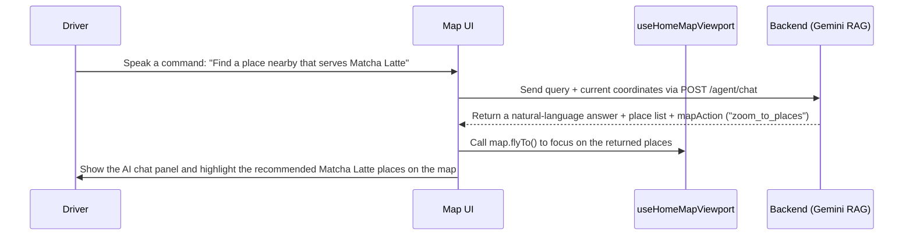

# Waze Clone - Frontend Technical Roadmap

This document describes the frontend development roadmap for MiaMap (React/Next.js and Leaflet) as it evolves into a Waze-like system with highly visual map interactions and AI Agent integration.

For short-term implementation priorities, see the dedicated sprint plan:
- [Frontend Sprint Plan](./frontend-sprint-plan.md)

> [!WARNING]
> **Geographic data scope limit**: Because nationwide or citywide spatial data and traffic graphs are extremely large and expensive to compute, the current MiaMap system and all planned Waze-like extensions are limited to **District 1, Ho Chi Minh City, Vietnam only**.
>
> Approximate coordinate scope:
> - Latitude: `10.7600` to `10.7950`
> - Longitude: `106.6800` to `106.7150`
>
> The map should default to District 1, and all place suggestions, routing flows, and incident reporting should stay within this administrative area.

---

## Frontend Architecture and AI Agent Interaction Flow

---

## Detailed Delivery Stages (Frontend)

### Stage 0: Foundation and District 1 Positioning (Completed)
- **Goal**: Build the initial map UI centered on District 1 and connect it to static routing.
- **Implementation details**:
  - `[DONE]` Map center configuration: Set the default map center to District 1, Ho Chi Minh City at `[10.7712, 106.6980]`.
  - `[DONE]` Static polyline rendering: Read route coordinate lists from `GET /places/route` and render the route in a single blue stroke `#1d9bf0` in [HomeMap.tsx](/C:/github-projects/MiaMap/miamap-frontend/src/features/home/components/HomeMap.tsx).
  - `[DONE]` SSR handling: Dynamically load the map component in client-only mode (`ssr: false`) to avoid server-side rendering issues in [home-page.tsx](/C:/github-projects/MiaMap/miamap-frontend/src/features/home/home-page.tsx:11).

### Stage 1: Crowdsourced Incidents (Visual Reporting UX)
- **Goal**: Design a highly accessible UI for submitting incident reports with one or two taps while driving in District 1.
- **UI to build**:
  - `[NEW]` [ReportMenuModal.tsx](/C:/github-projects/MiaMap/miamap-frontend/src/features/home/components/ReportMenuModal.tsx)
    A large circular or grid-style overlay for choosing incident types quickly with one hand.
  - `[MODIFY]` [HomeMap.tsx](/C:/github-projects/MiaMap/miamap-frontend/src/features/home/components/HomeMap.tsx)
    - Display incidents with eye-catching custom marker icons.
    - Add pulse or glow effects for urgent incidents such as accidents or police ahead.
    - Show a lightweight popup or tooltip while passing an incident, with quick actions such as `Still there` or `Gone`.

### Stage 2: Multicolor Traffic Flow Rendering (Traffic Polyline)
- **Goal**: Visualize road conditions in District 1 as clearly as possible.
- **Code to modify**:
  - `[MODIFY]` [HomeMap.tsx](/C:/github-projects/MiaMap/miamap-frontend/src/features/home/components/HomeMap.tsx)
    - Read `route.segments` from the API and render layered `<Polyline>` elements with a darker outer stroke and traffic-specific inner colors:
      - **Heavy Traffic**: Dark red `#ef4444` with animated dash movement to suggest very slow motion.
      - **Moderate Traffic**: Orange `#f97316`.
      - **Clear Traffic**: Bright green `#10b981`.

### Stage 3: GPS Navigation Mode and WebSocket Sync (SignalR)
- **Goal**: Deliver a more natural navigation experience while showing nearby drivers in District 1.
- **Code to build**:
  - `[NEW]` [useGeolocation.ts](/C:/github-projects/MiaMap/miamap-frontend/src/hooks/useGeolocation.ts)
    Track the phone's live GPS position, movement speed, and heading.
  - `[NEW]` [useNavigationSocket.ts](/C:/github-projects/MiaMap/miamap-frontend/src/features/home/hooks/useNavigationSocket.ts)
    Connect to the SignalR hub, send periodic coordinates, and receive nearby Wazer positions.
  - `[NEW]` [NavigationOverlay.tsx](/C:/github-projects/MiaMap/miamap-frontend/src/features/home/components/NavigationOverlay.tsx)
    - Large top navigation banner.
    - A speedometer that changes color when the driver exceeds the allowed speed.
    - Natural voice guidance using the Web Speech API for upcoming turns.
  - `[MODIFY]` [HomeMap.tsx](/C:/github-projects/MiaMap/miamap-frontend/src/features/home/components/HomeMap.tsx)
    Render nearby driver vehicles on the map and optionally rotate the map to match the driver's heading.

### Stage 4: User Personalization and Gamification
- **Goal**: Let drivers choose visible vehicle avatars and engage more deeply with the platform.
- **Code to build**:
  - `[NEW]` [UserProfilePanel.tsx](/C:/github-projects/MiaMap/miamap-frontend/src/features/home/components/UserProfilePanel.tsx)
    Let users choose playful mood icons unlocked by level.
  - `[NEW]` [IncidentChatBox.tsx](/C:/github-projects/MiaMap/miamap-frontend/src/features/home/components/IncidentChatBox.tsx)
    A lightweight comment box attached directly to traffic jam or accident locations on the map.

### Stage 5: AI Agent Assistant and Detailed Product Search

#### A. Detailed product search (Menu Search UI)
- **UI/UX**:
  - When the user searches for `matcha latte` or `Vietnamese iced coffee` in District 1, the result list should not only show the store name, but also matching menu items and pricing beneath each place card.
  - Tapping a product should immediately show a `Navigate here` action.

#### B. Floating AI Agent chat panel on the map
Add a corner chat assistant so the map can be controlled by voice or text.

- **UI**:
  - `[NEW]` [AIAgentPanel.tsx](/C:/github-projects/MiaMap/miamap-frontend/src/features/home/components/AIAgentPanel.tsx)
    A floating map chat panel with voice input support.
- **Integration flow**:
  1. The user types: `"Find a place nearby that serves Matcha Latte"`.
  2. The frontend sends the question and the current map coordinates to `POST /agent/chat`.
  3. The frontend receives the AI response and renders it as chat bubbles, for example: `"I found 3 nearby cafes in District 1 that serve Matcha Latte. Cafe X is 500m away and rated 4.8 stars..."`
  4. **Automatic map control**:
     - If the API returns `mapAction: "zoom_to_places"`, the frontend automatically calls `map.flyTo()` or `map.fitBounds()` around the recommended places.
     - Highlight those places with a distinct icon, for example a sparkling Matcha cup icon.
     - If the user then asks `"Navigate me to the best one"`, the AI Agent can return `mapAction: "draw_route"` together with the target place ID, and the frontend automatically renders the best route that avoids heavy traffic.
